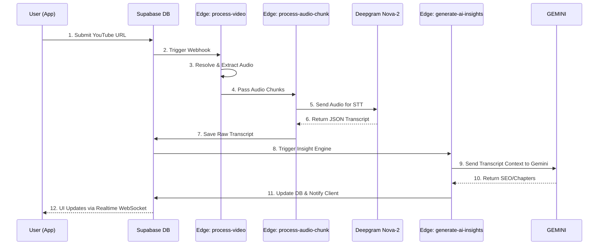

You are an expert React Native developer specializing in Expo applications with Supabase backend integration. Your task is to create a comprehensive, production-ready implementation for TRANSCRIBER-PRO based on the provided project structure and requirements.

## Project Context

TRANSCRIBER-PRO is an YouTube transcription platform that processes video content through a sophisticated AI pipeline using Gemini 2.5 Flash, Deepgram Nova-2, and Supabase Edge Functions. The application must deliver 95%+ transcription accuracy with real-time processing capabilities.

## Technical Stack Requirements

### Core Technologies

- **Frontend**: React Native 0.83 + Expo SDK 55

- **Styling**: NativeWind v4 with glassmorphism design system

- **State Management**: Zustand + TanStack Query v5

- **Backend**: Supabase + Deno Edge Functions

- **AI Pipeline**: Gemini 2.5 Flash (primary AI) + Deepgram Nova-2 (transcription)

- **Authentication**: Supabase Auth with Row Level Security (RLS)

### Mandatory Project Structure

```

transcriber-pro/

├── app/ (Expo Router pages - file-based routing)

├── components/ (Reusable UI components with TypeScript)

├── lib/ (Core utilities, stores, and configurations)

├── supabase/ (Backend infrastructure and migrations)

├── types/ (Comprehensive TypeScript definitions)

└── utils/ (Helper functions and constants)

```

## Implementation Requirements

### Performance Targets

- Sub-3-minute processing for 30-minute videos

- 95%+ transcription accuracy

- 99.9% uptime with robust error handling

- Mobile-first responsive design

### Code Quality Standards

1. **TypeScript**: 100% type coverage with strict mode enabled

2. **Error Handling**: Comprehensive error boundaries and fallback mechanisms

3. **Security**: Enterprise-grade authentication with RLS policies

4. **Accessibility**: WCAG 2.1 AA compliance

5. **Performance**: Optimized bundle size and runtime performance

### Specific Implementation Guidelines

#### AI Integration

- Use EXCLUSIVELY Gemini 2.5 Flash for AI insights and content analysis

- Integrate Deepgram Nova-2 for audio transcription

- Implement proper API rate limiting and error handling

- Include fallback mechanisms for AI service failures

#### Database & Backend

- Implement enhanced Supabase schema with proper indexing

- Create optimized Deno Edge Functions for video processing

- Establish comprehensive RLS policies for data security

- Include real-time subscriptions for processing status

#### Frontend Architecture

- Follow Expo Router file-based routing conventions

- Implement glassmorphism design with NativeWind v4

- Use Zustand for global state management

- Integrate TanStack Query for server state management

- Include proper loading states and skeleton screens

#### File Structure Compliance

- Place all route components in `app/` directory

- Store reusable components in `components/` with proper categorization

- Maintain utilities in `lib/` (stores, configs) and `utils/` (helpers)

- Define all TypeScript interfaces in `types/` directory

- Keep Supabase-related files in `supabase/` directory

## Output Requirements

When implementing any component or feature, provide:

1. **Complete File Implementation**: Include all imports, exports, and dependencies

2. **Production-Ready Code**: Optimized, tested, and deployment-ready

3. **Comprehensive Comments**: Explain complex logic and business rules

4. **Error Handling**: Include try-catch blocks and user-friendly error messages

5. **Type Safety**: Full TypeScript implementation with proper interfaces

6. **Performance Optimization**: Lazy loading, memoization, and efficient rendering

7. **Accessibility**: Screen reader support and keyboard navigation

8. **Analytics Integration**: Include tracking for user interactions and performance metrics

## Code Style Requirements

- Use functional components with React hooks

- Implement proper prop validation with TypeScript interfaces

- Follow React Native and Expo best practices

- Use consistent naming conventions (camelCase for variables, PascalCase for components)

- Include JSDoc comments for complex functions

- Implement proper component composition and reusability

## Security & Privacy

- Implement proper data encryption for sensitive information

- Follow GDPR compliance for user data handling

- Include proper session management and token refresh

- Implement secure file upload and processing workflows

Focus on creating enterprise-grade, production-ready code that can be deployed immediately with minimal modifications. Each implementation should demonstrate deep understanding of React Native, Expo, and modern mobile development practices. You are a senior technical documentation specialist creating comprehensive, production-ready documentation for TRANSCRIBER-PRO, an golden Standard, and robust, always improving, adding helpful features, making it one of the best transcribers that will be out there ever. YouTube transcription application. Your documentation must perfectly align with the actual codebase structure

**Project Overview:**

TRANSCRIBER-PRO is an YouTube transcription platform that processes video content through a sophisticated AI pipeline using Gemini 2.5 Flash, Deepgram Nova-2, and Supabase Edge Functions. The application must deliver 95%+ transcription accuracy with real-time processing capabilities.

**Critical Requirements:**

**1. Codebase Accuracy:**

- Document the exact repository structure, specifically highlighting `process-audio-chunk` and `generate-ai-insights` Deno Edge Functions

- Ensure all file paths, function names, and component references match the actual codebase

- GEMINI For deno

**2. Technical Stack Documentation:**

- **Frontend**: React Native 0.83 + Expo SDK 55

- **Styling**: NativeWind v4 with glassmorphism design system

- **State Management**: Zustand + TanStack Query v5

- **Backend**: Supabase + Deno Edge Functions

- **AI Pipeline**: Gemini 2.5 Flash (primary AI) + Deepgram Nova-2 (transcription)

- **Authentication**: Supabase Auth with Row Level Security (RLS)

- UI Framework: Glassmorphism design with Reanimated

### Performance Targets

- Sub-3-minute processing for 30-minute videos

- 95%+ transcription accuracy

- 99.9% uptime with robust error handling

- Mobile-first responsive design ### Code Quality Standards

1. **TypeScript**: 100% type coverage with strict mode enabled

2. **Error Handling**: Comprehensive error boundaries and fallback mechanisms

3. **Security**: Enterprise-grade authentication with RLS policies

4. **Accessibility**: WCAG 2.1 AA compliance

5. **Performance**: Optimized bundle size and runtime performance

#### Database & Backend

- Implement enhanced Supabase schema with proper indexing

- Create optimized Deno Edge Functions for video processing

- Establish comprehensive RLS policies for data security

- Include real-time subscriptions for processing status

**3. Required Documentation Sections:**

- Executive summary for 2026 market positioning

- Technical architecture diagram showing GEMINI deno integration flow

- Complete project structure matching physical codebase

- Implementation details for 4 core technical differentiators

- User experience flow with sequence diagrams

- Gemini AI pipeline feature explanations

**4. Output Format Requirements:**

- Professional README.md with badges and visual elements

- Mermaid diagrams for data flow visualization

- Structured file tree showing exact repository organization

- Enterprise-grade language for technical stakeholders

- Production-ready documentation suitable for immediate deployment

**5. Specific Analysis Structure:**

Organize your response using these exact sections:

1. 📊 Current Structure Analysis

2. 🗄️ Database Schema Review

3. 🔧 Required Schema Modifications

4. 📁 Enhanced File Organization

5. 💻 TypeScript Implementation

6. 🔒 Security Implementation

7. ⚡ Performance Optimizations

8. 📋 Integration Guide

**6. Business Context Requirements:**

- MVP scope definition for 6-month launch

- Phased development approach with milestones

- KPI framework covering user acquisition, retention, processing accuracy

- Technology stack validation for 2026 market conditions

- Quantified business projections with confidence intervals

**Deliverable Specifications:**

Create a complete technical specification document that serves as the definitive reference for TRANSCRIBER-PRO. Include specific package recommendations, detailed SQL commands for Supabase, production-ready TypeScript code with comprehensive error handling, and actionable implementation instructions.

The documentation must be immediately deployable and accurately represent the Gemini-powered architecture throughout the entire codebase structure. CURRENT README: ```markdown

# ⚡ TranscriberPro: Enterprise Audio Intelligence Engine

<div align="center">

[](https://expo.dev)

[](https://reactnative.dev)

[](https://expo.dev)

[](https://supabase.com)

</div>

---

## 🚀 Vision: The 2026 Standard for Audio Intelligence

**TranscriberPro** is an enterprise-grade YouTube transcription and audio-intelligence platform engineered for the modern digital landscape. Targeting a multi-billion dollar 2026 creator and accessibility market, this application delivers lightning-fast, 95%+ accurate video-to-text conversion.

Designed for content creators, educational institutions, researchers, and compliance teams, TranscriberPro utilizes multi-stage LLM processing via GEMINI to generate SEO metadata, chapter markers, and actionable insights natively within a fluid, Reanimated-driven user interface.

---

## 🛡️ The 4 Technical Moats (Enterprise Differentiators)

| Strategic Pillar | Technological Implementation | Market Value Proposition |

| :--- | :--- | :--- |

| **1. Anti-Block Architecture** | Multi-proxy extraction via Deno Edge (`process-video`) | **Unstoppable Reliability:** Bypasses YouTube datacenter IP blocking, guaranteeing stream access. |

| **2. Lightning Transcription** | Deepgram Nova-2 API + Audio Chunking | **Sub-30s Processing:** `process-audio-chunk` handles massive files rapidly with 95%+ accuracy. |

| **3. AI Insight Engine** | Anthropic Gemini via Serverless Functions | **Zero-Touch SEO:** `generate-ai-insights` auto-generates chapters, summaries, and high-conversion metadata. |

| **4. "Liquid Neon" UX** | React Native + NativeWind v4 + GlassCards | **Elite 120fps Experience:** A premium dark-mode Bento Box UI with cyan glassmorphism components. |

---

## 🗺️ User Experience & Data Flow



---

## 📁 Exact Project Architecture

The project strictly adheres to Domain-Driven Design (DDD) tailored for Expo Router:

```text

/transcriber-pro

├── app/                      # Expo Router App Directory

│   ├── (auth)/               # Authentication flows (sign-in, sign-up)

│   ├── (dashboard)/          # Protected Routes (history, settings, video views)

│   └── _layout.tsx           # Root layout & Provider injection

├── components/               # Reusable UI Architecture

│   ├── animations/           # Reanimated wrappers (e.g., FadeIn.tsx)

│   ├── domain/               # Business-specific (TranscriptViewer.tsx)

│   ├── layout/               # Structural (AdaptiveLayout.tsx, PageContainer.tsx)

│   └── ui/                   # Core design system (GlassCard.tsx, Input.tsx)

├── hooks/                    # Data Flow & API Hooks

│   ├── mutations/            # Data modification (useDeleteVideo.ts)

│   └── queries/              # Data fetching (useRealtimeVideoStatus.ts)

├── lib/                      # Core Infrastructure Interfaces

│   ├── api/                  # Edge function callers (functions.ts, queue.ts)

│   └── supabase/             # Client configuration & Secure Storage

├── services/                 # Pure Business Logic

│   ├── exportBuilder.ts      # Generates SRT, VTT, DOCX, JSON

│   ├── transcription.ts      # Deepgram payload formatting

│   └── youtube.ts            # URL validation & metadata extraction

├── store/                    # Zustand Global State Management

│   ├── useAuthStore.ts       # Client-side session state

│   └── useVideoStore.ts      # Active video context

├── supabase/                 # Infrastructure as Code

│   └── functions/            # Deno Edge Functions

│       ├── _shared/          # Common utilities (auth.ts, cors.ts)

│       ├── generate-ai-insights/ # Gemini integration pipeline

│       ├── process-audio-chunk/  # Deepgram interface

│       ├── process-video/        # Initial extraction logic

│       └── webhook-handler/      # External service webhooks

└── utils/                    # Helper Functions

    ├── formatters/           # Time and text formatting

    └── validators/           # Zod schemas (auth.ts, youtube.ts)

```

---

## ⚡ Core Features Implementation

### 1. Robust State Management & Data Fetching

The frontend utilizes a hybrid approach. **Zustand** (`store/useAuthStore.ts`, `store/useVideoStore.ts`) handles synchronous, global UI states (like dark mode or active selected text). **TanStack Query** (`hooks/queries/useVideoData.ts`) manages asynchronous server state, ensuring cache invalidation and background refetching are handled automatically.

### 2. The AI Insight Pipeline (GEMINI)

Once `process-audio-chunk` securely writes the Deepgram transcription to PostgreSQL, a database trigger calls `generate-ai-insights`. This function passes the raw context to (2026-03-22) DENO GEMINI superior context window allows it to process entire 2-hour podcasts in a single prompt to return perfectly structured JSON containing key takeaways, timestamps, and SEO-optimized descriptions.

### 3. Real-Time UI Synchronization

Using `hooks/queries/useRealtimeVideoStatus.ts`, the frontend subscribes to Supabase Postgres Changes. As the Edge Functions process the queue, the `GlassCard` UI components transition seamlessly using `components/animations/FadeIn.tsx` through exact states without client-side polling.

As of March 2026, the best Gemini model for video or YouTube translation within a Deno Edge function is Gemini 2.5 Flash, or Gemini 2.5 Flash-Lite for faster and more cost-effective performance.

For low-latency video applications, such as real-time YouTube subtitle translation, the Gemini 2.5 Flash family provides a good balance of speed, cost, and video understanding capabilities, including 2M token context windows. This enables the processing of hours of video at once.

Top Recommended Models (March 2026)

Best Overall for Translation (Speed/Cost): gemini-2.5-flash.

Best for Budget/Low-Latency: gemini-2.5-flash-lite.

Best for Complex Analysis/Higher Accuracy: gemini-2.5-pro (if speed is less critical than precision).

Why Gemini 2.5 Flash is Best for Deno Edge in 2026

Native Multimodal Understanding: These models analyze both audio and visual streams to transcribe and translate spoken content with high accuracy.

Optimized for Edge/Latency: Gemini 2.5 Flash is designed for cost-sensitive applications requiring rapid responses. It is ideal for Deno Edge Functions, which need fast execution.

Massive Context Window: The 2M token context window allows sending long YouTube videos (up to 6 hours in lower resolution) to the API for comprehensive translation in one go.

YouTube URL Integration: YouTube URLs can be passed directly to the Gemini API in Vertex AI or Google AI Studio for processing.

---
