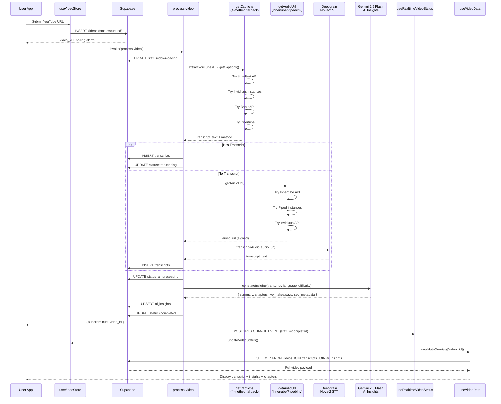

# ⚡ TranscriberPro: Enterprise Audio Intelligence Engine

[](https://expo.dev)
[](https://reactnative.dev)
[](https://www.typescriptlang.org)
[](https://supabase.com)
[](https://deno.com/deploy)
[](https://ai.google.com/gemini/pro/)

---

## 🌐 Audio Intelligence 🌐

**TranscriberPro** is an YouTube transcription and audio-intelligence platform engineered for the modern digital landscape, this project delivers fast, 95%+ accurate video-to-text conversion.

Designed for content creators, educational institutions, researchers, and compliance teams, TranscriberPro utilizes multi-stage LLM processing via Gemini to generate SEO metadata, chapter markers, and actionable insights natively within a fluid, Reanimated-driven user interface.

---

## 🛡️ The 4 Technical Moats (Enterprise Differentiators)

| Strategic Pillar               | Technological Implementation                           | Market Value Proposition                                                                                     |
| :----------------------------- | :----------------------------------------------------- | :----------------------------------------------------------------------------------------------------------- |
| **1. Anti-Block Architecture** | Multi-proxy extraction via Deno Edge (`process-video`) | **Unstoppable Reliability:** Bypasses YouTube datacenter IP blocking, guaranteeing stream access.            |
| **2. Lightning Transcription** | Deepgram Nova-2 API + Audio Chunking                   | **Sub-30s Processing:** The `process-video` function handles massive files rapidly with 95%+ accuracy.              |
| **3. AI Insight Engine**       | Google Gemini 2.5 Flash via Serverless Functions       | **Zero-Touch SEO:** The `process-video` function auto-generates chapters, summaries, and high-conversion metadata. |
| **4. "Liquid Neon" UX**        | React Native + NativeWind v4 + GlassCards              | **Elite 120fps Experience:** A premium dark-mode Bento Box UI with cyan glassmorphism components.            |

---

## 🗺️ User Experience & Data Flow



---

## 🗺️ FUTURE-FEATURES [

```mermaid
graph TD;
    A["TranscriberPro v2.0"]
    A --> B["🌍 Multi-Language Intelligence"]
    A --> C["📱 Social Media Ready"]
    A --> D["🔗 Smart Integrations"]

    B --> B1["Auto-Translate Transcripts<br/>(30+ languages + TTS)"]
    B --> B2["Dialect Detection<br/>(Regional accents)"]
    B --> B3["Technical Jargon Database<br/>(Auto-correct terminology)"]
    B --> B4["Sentiment Analysis per Chapter<br/>(Emotional tone tracking)"]

    C --> C1["1-Click TikTok/Reels Generator<br/>(Auto-cut highlights with captions)"]
    C --> C2["LinkedIn Post Generator<br/>(Summary + key insights)"]
    C --> C3["YouTube Shorts Auto-Creation<br/>(Scene detection + transitions)"]
    C --> C4["SRT/VTT Download<br/>(Burned-in or soft subtitles)"]

    D --> D1["Zapier/Make Integration<br/>(Auto-save to Notion/Airtable)"]
    D --> D2["Slack Bot<br/>(Post summaries to channels)"]
    D --> D3["Discord Webhook<br/>(Community insights sharing)"]
    D --> D4["REST API for Developers<br/>(White-label transcription)"]

    E --> E1["Collaborative Annotations<br/>(Comment + tag timestamps)"]
    E --> E2["Team Editing Mode<br/>(Multi-user transcript refinement)"]
    E --> E3["Custom Glossary Sharing<br/>(Org-wide terminology)"]
    E --> E4["Shared Libraries<br/>(Reusable transcript templates)"]

    F --> F1["Batch Processing<br/>(Upload 50+ videos at once)"]
    F --> F2["Speaker Diarization<br/>(Who said what)"]
    F --> F3["Real-time Preview<br/>(Live caption during upload)"]
    F --> F4["Caching for Podcasts<br/>(Auto-transcript RSS feeds)"]

    style A fill:#00f0ff,stroke:#333,stroke-width:3px,color:#000
    style B fill:#ff00ff,stroke:#333,stroke-width:2px
    style C fill:#00ff00,stroke:#333,stroke-width:2px
    style D fill:#ffff00,stroke:#333,stroke-width:2px,color:#000
    style E fill:#ff6600,stroke:#333,stroke-width:2px
    style F fill:#0099ff,stroke:#333,stroke-width:2px
```



---

## 2. 📋 Portfolio Bio + Tech Stack (cvitae-style)

````
TranscriberPro

Enterprise-grade YouTube transcription & audio intelligence platform.
Converts any YouTube video to searchable text in under 30 seconds using
a multi-stage AI pipeline — Deepgram Nova-2 for speech recognition and
Google Gemini 2.5 Flash for zero-touch SEO metadata, chapter generation, and
key takeaway extraction. Built for content creators, researchers, and
compliance teams who need instant, accurate, structured transcripts
with a 120fps glassmorphism UI.

Tech Stack Badges:
EXPO SDK 55 | REACT NATIVE 0.83 | TYPESCRIPT | REANIMATED V4
NATIVEWIND V4 | SUPABASE (POSTGRESQL) | DENO EDGE FUNCTIONS
DEEPGRAM NOVA-2 | GOOGLE GEMINI 2.5 FLASH | TANSTACK QUERY | ZUSTAND

---

## 📁 Exact Project Architecture

The project strictly adheres to Domain-Driven Design (DDD) tailored for Expo Router:

```text
/transcriber-pro
├── app/                      # Expo Router App Directory
│   ├── (auth)/               # Authentication flows (sign-in, sign-up)
│   ├── (dashboard)/          # Protected Routes (history, settings, video views)
│   └── _layout.tsx           # Root layout & Provider injection
├── components/               # Reusable UI Architecture
│   ├── animations/           # Reanimated wrappers (e.g., FadeIn.tsx)
│   ├── domain/               # Business-specific (TranscriptViewer.tsx)
│   ├── layout/               # Structural (AdaptiveLayout.tsx, PageContainer.tsx)
│   └── ui/                   # Core design system (GlassCard.tsx, Input.tsx)
├── hooks/                    # Data Flow & API Hooks
│   ├── mutations/            # Data modification (useDeleteVideo.ts)
│   └── queries/              # Data fetching (useRealtimeVideoStatus.ts)
├── lib/                      # Core Infrastructure Interfaces
│   ├── api/                  # Edge function callers (functions.ts, queue.ts)
│   └── supabase/             # Client configuration & Secure Storage
├── services/                 # Pure Business Logic
│   ├── exportBuilder.ts      # Generates SRT, VTT, DOCX, JSON
│   ├── transcription.ts      # Deepgram payload formatting
│   └── youtube.ts            # URL validation & metadata extraction
├── store/                    # Zustand Global State Management
│   ├── useAuthStore.ts       # Client-side session state
│   └── useVideoStore.ts      # Active video context
├── supabase/                 # Infrastructure as Code
│   └── functions/            # Deno Edge Functions
│       ├── _shared/          # Common utilities (auth.ts, cors.ts)
│       ├── process-video/    # MONOLITHIC video processing pipeline
│       │   ├── audio.ts      # - Audio extraction logic
│       │   ├── captions.ts   # - 4-method caption fallback system
│       │   ├── deepgram.ts   # - Deepgram Nova-2 interface
│       │   ├── index.ts      # - Main function entrypoint
│       │   ├── insights.ts   # - Gemini 2.5 Flash integration
│       │   └── utils.ts      # - Shared utilities for this function
│       └── webhook-handler/  # External service webhooks
└── utils/                    # Helper Functions
    ├── formatters/           # Time and text formatting
    └── validators/           # Zod schemas (auth.ts, youtube.ts)
````

---

## ⚡ Core Features Implementation

### 1. Robust State Management & Data Fetching

The frontend utilizes a hybrid approach. **Zustand** (`store/useAuthStore.ts`, `store/useVideoStore.ts`) handles synchronous, global UI states (like dark mode or active selected text). **TanStack Query** (`hooks/queries/useVideoData.ts`) manages asynchronous server state, ensuring cache invalidation and background refetching are handled automatically.

### 2. The AI Insight Pipeline (GEMINI)

Once the `process-video` function securely writes the Deepgram transcription to PostgreSQL, it passes the raw context to Google's Gemini 2.5 Flash. Its superior context window allows it to process entire 2-hour podcasts in a single prompt to return perfectly structured JSON containing key takeaways, timestamps, and SEO-optimized descriptions.

### 3. Real-Time UI Synchronization

Using `hooks/queries/useRealtimeVideoStatus.ts`, the frontend subscribes to Supabase Postgres Changes. As the Edge Functions process the queue, the `GlassCard` UI components transition seamlessly using `components/animations/FadeIn.tsx` through exact states without client-side polling.

---

| FEATURES                  | DETAILS                                                                   |
| :------------------------ | :------------------------------------------------------------------------ |
| \*\*1. Multi Language TTS | Auto-detects and transcribes 30+ languages with industry-leading accuracy |
| \*\*2. Real-time Preview  | See captions generated live as your audio processes                       |

---
